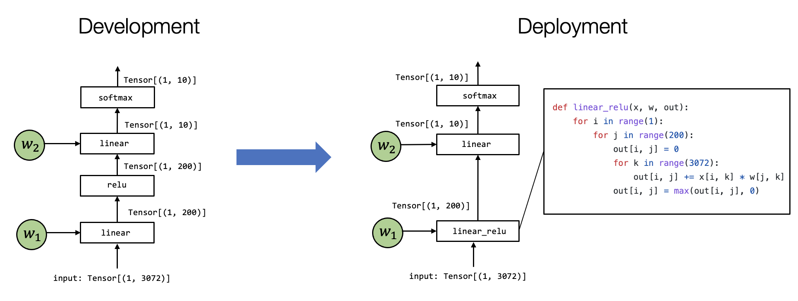

# Introduction

MLC goal:

* Integration and dependency minimization
* Leveraging hardware native acceleration
* Optimization in general

Most MLC process can be viewed as transformation among tensor functions(that can be represented with different abstractions)